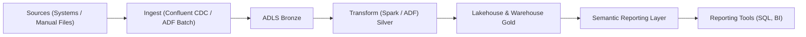

# ETL-Framework for Manual Files
This repository is a public showcase of our Historic Data Loading Framework.
The full production project is maintained in a private repository.

# Purpose
The goal of this framework is to:
Build a strong data foundation for reporting and analytics.
Enable efficient, governed, and reliable access to data.
Maximize shareholder value by leveraging data to support decision-making.

# Data Flow

??create a figure here describing the below
Sources (Systems or Manual files)->Ingest (Confluent CDC/ADF Batch)->ADLS bronze->Transform(Spark/ADF) silver->Lakehouse & Warehouse Gold-> sematic reporting layer->reporting tools like sql, bi
??explain the figure
bronze is where raw data is loaded into and will help us create an inital data mapping. usually the only etl here is loading. in the silver we extract from the bronze and transform. in addition a silver data mapping is created. we also implement LDM and PDM. finally in the gold layer we have the buisness metadata and plan a data mart
Bronze: Raw data is ingested from source systems with little or no transformation. It serves as the immutable system of record.
Silver: Data is cleaned, standardized, and transformed into a consistent structure. Here we implement logical and physical data models to align data across domains.
Gold: Curated data is enriched with business metadata and optimized for consumption (e.g., data marts, semantic layers, reports).
??create a diagram of ETL 
??description for ETL
This ETL framework diagram illustrates the complete flow of how data moves from its sources into the final target system while being managed, cleaned, and transformed along the way. The process begins with extracting data from multiple sources such as relational databases, XML files, flat files, or even manual entry. Extraction is managed by triggers, schedulers, adapters, and monitoring tools, with all raw data first staged and standardized for consistency. Once extracted, the data undergoes a cleaning process where it is parsed, corrected, standardized, deduplicated, consolidated, and quality-checked to ensure reliability. After cleaning, the transformation phase applies both source-specific and common transformations, performs aggregations, and replaces natural keys with surrogate keys for consistency in the data warehouse. Following transformation, the load phase populates the target system using various strategies, including building aggregates for OLAP analysis, handling slowly changing dimensions, and supporting multi-grained fact tables. Throughout this process, metadata management plays a key role, maintaining both technical metadata (schemas, data types) and business metadata (definitions, meaning) within a central repository. To support the ETL process, additional services handle rejected data, batch scheduling, configuration, logging, auditing, archiving, exception handling, parameterization, file transfer, version control, monitoring, and data purging. Together, these components ensure that data is moved from raw sources into a clean, consistent, and well-managed target system, ready for business use and analysis.

??complete the below
Documentation, setup, manual

Developer and user documentation covering: maybe this is in the report
Pipeline logic, schema drift framework, data dictionary usage.
Steps to extend the solution for new systems or columns.
Troubleshooting and error resolution guide.

create something similar to this or any other project that is placed on github
https://github.com/ak7ra/frog_classification
