# ETL-Framework for Manual Files
Production code lives in a private repository. This repo showcases the design, standards, and runnable examples for our Historic Data Loading Framework.

# Purpose
The goal of this framework is to:
Build a strong data foundation for reporting and analytics.
Enable efficient, governed, and reliable access to data.
Maximize shareholder value by leveraging data to support decision-making.


```??this is to be done
i have given some context but need it to be connected together and better made.
ure expected to show the whole high level overview of the project.
Bronzelayer: datamapping, etlprocceses,data laoding,dq rules, technical metadata
silverlayer: silver data model review, dilver data mapping, ldm to pdm implementation, etl processes, data catalogue
goldlayer: buisness metadata, plan data mart

source systems can be either ingested using streaming or batch and the goes theough bronze then silver then gold. after we have the semantic layer then into reporting tools
the manual file techincally go through bronze and silver but since the use case is just for buisess we just transofrm and upload to gold layer but then we have semantic layer and then reporting tools like bi,

explain the etl framerok. extract using CDC trigger and batch schedule->raw data staging->clean->transform->Load->precommit staging->data target


```
# Data Flow

```mermaid
flowchart LR
  %% Groups
  subgraph SRC[Sources]
    direction TB
    SYS[🖥️ Systems]
    MF[📄 Manual Files]
  end

  subgraph ING[Ingest]
    direction TB
    CDC[🔁 Confluent CDC]
    ADFI[🧭 ADF Batch]
  end

  subgraph LAKE[ADLS + Lakehouse Layers]
    direction LR
    BRZ[🥉 Bronze\nRaw & Immutable]
    SIL[🥈 Silver\nCleansed & Modeled]
    GLD[🥇 Gold\nCurated & Semantic]
  end

  subgraph CONS[Consumption]
    direction TB
    SL[🧠 Semantic Layer]
    BI[📊 SQL / BI Tools]
  end

  %% Flow
  SYS --> CDC --> BRZ
  SYS --> ADFI --> BRZ
  MF --> ADFI --> BRZ
  BRZ -->|Spark / ADF Transform| SIL --> GLD --> SL --> BI

  %% Styles
  classDef src fill:#eef6ff,stroke:#2b6cb0,color:#1a365d
  classDef ing fill:#fff7ed,stroke:#9a3412,color:#7c2d12
  classDef bronze fill:#f3f4f6,stroke:#4b5563,color:#1f2937
  classDef silver fill:#f8fafc,stroke:#334155,color:#0f172a
  classDef gold fill:#fffbeb,stroke:#92400e,color:#78350f
  classDef sem fill:#ecfeff,stroke:#155e75,color:#0c4a6e
  classDef bi fill:#f0fdf4,stroke:#166534,color:#14532d

  class SYS,MF src
  class CDC,ADFI ing
  class BRZ bronze
  class SIL silver
  class GLD gold
  class SL sem
  class BI bi

```

Bronze: Raw data ingested with little/no transformation; immutable “system of record.” Used to establish initial data mappings. ETL here is load-only (schema-on-write minimal).

Silver: Data is cleaned, standardized, and conformed. We implement Logical Data Model (LDM) and Physical Data Model (PDM) and create/maintain the silver data mapping.

Gold: Curated, business-ready datasets enriched with business metadata, optimized for consumption (semantic models, data marts, KPI tables).


Extract from DBs, APIs, flat/XML/Excel/manual files via triggers/schedules and connectors; land into a standardized staging zone with monitoring.

Clean by parsing, standardizing, deduplicating, consolidating, and applying DQ rules; quarantine rejects.

Transform with reusable patterns, aggregations, surrogate keys, and SCD logic.

Load into target models (dimensions/facts, multi-grain facts, aggregates) using incremental strategies.

Metadata (technical + business) and platform services (orchestration, logging, config, governance) ensure reliability and traceability.

This ETL framework diagram illustrates the complete flow of how data moves from its sources into the final target system while being managed, cleaned, and transformed along the way. The process begins with extracting data from multiple sources such as relational databases, XML files, flat files, or even manual entry. Extraction is managed by triggers, schedulers, adapters, and monitoring tools, with all raw data first staged and standardized for consistency. Once extracted, the data undergoes a cleaning process where it is parsed, corrected, standardized, deduplicated, consolidated, and quality-checked to ensure reliability. After cleaning, the transformation phase applies both source-specific and common transformations, performs aggregations, and replaces natural keys with surrogate keys for consistency in the data warehouse. Following transformation, the load phase populates the target system using various strategies, including building aggregates for OLAP analysis, handling slowly changing dimensions, and supporting multi-grained fact tables. Throughout this process, metadata management plays a key role, maintaining both technical metadata (schemas, data types) and business metadata (definitions, meaning) within a central repository. To support the ETL process, additional services handle rejected data, batch scheduling, configuration, logging, auditing, archiving, exception handling, parameterization, file transfer, version control, monitoring, and data purging. Together, these components ensure that data is moved from raw sources into a clean, consistent, and well-managed target system, ready for business use and analysis.

??complete the below
Documentation, setup, manual, test files and so on

Developer and user documentation covering: maybe this is in the report
Pipeline logic, schema drift framework, data dictionary usage.
Steps to extend the solution for new systems or columns.
Troubleshooting and error resolution guide.

create something similar to this or any other project that is placed on github
https://github.com/ak7ra/frog_classification
